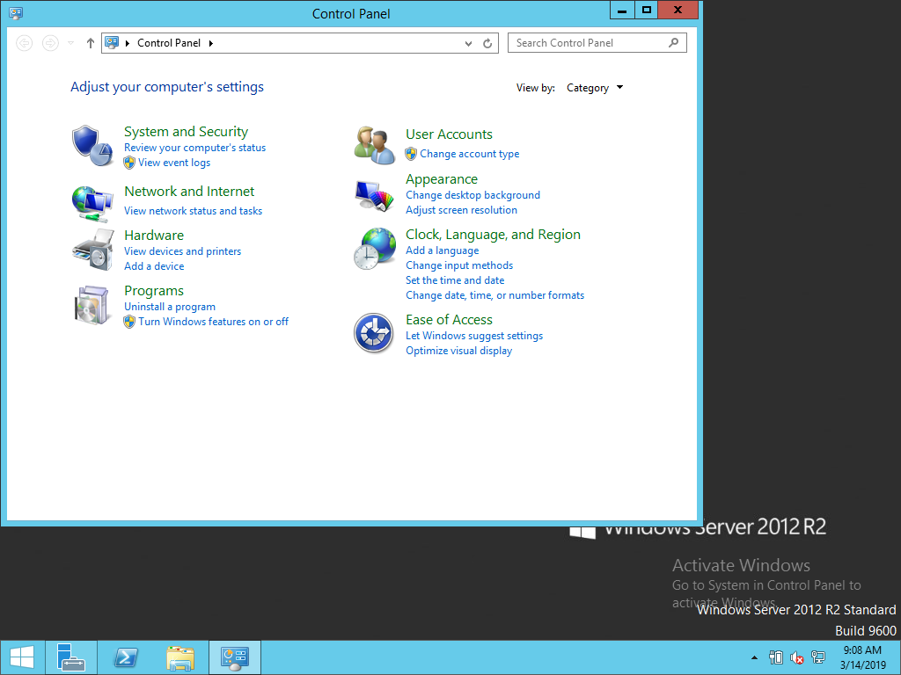
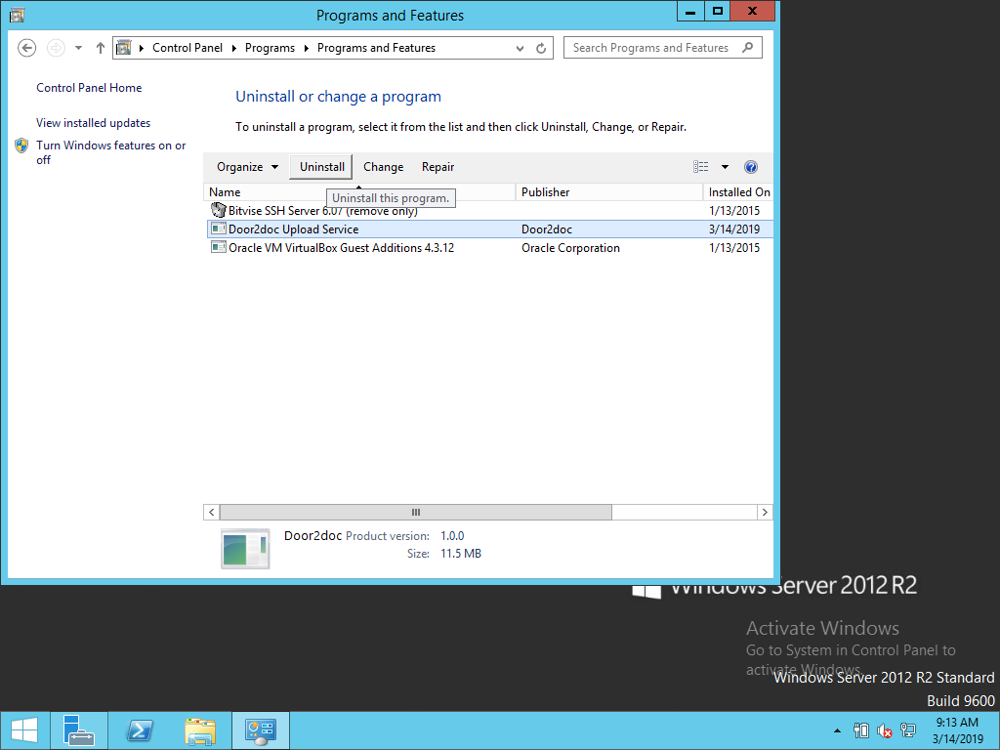
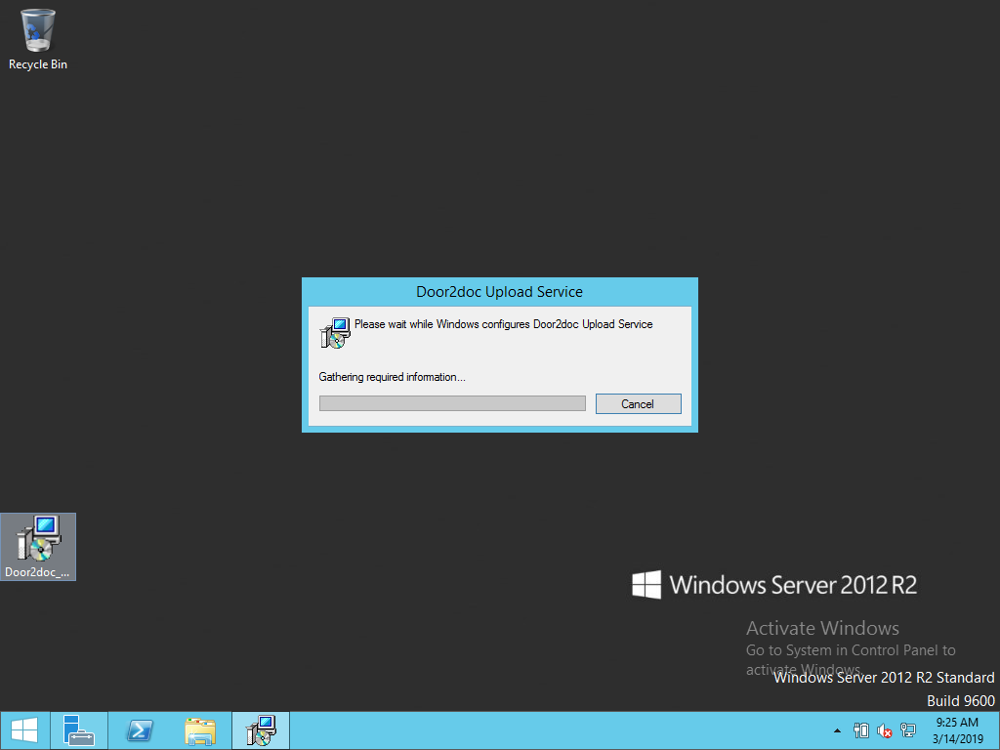
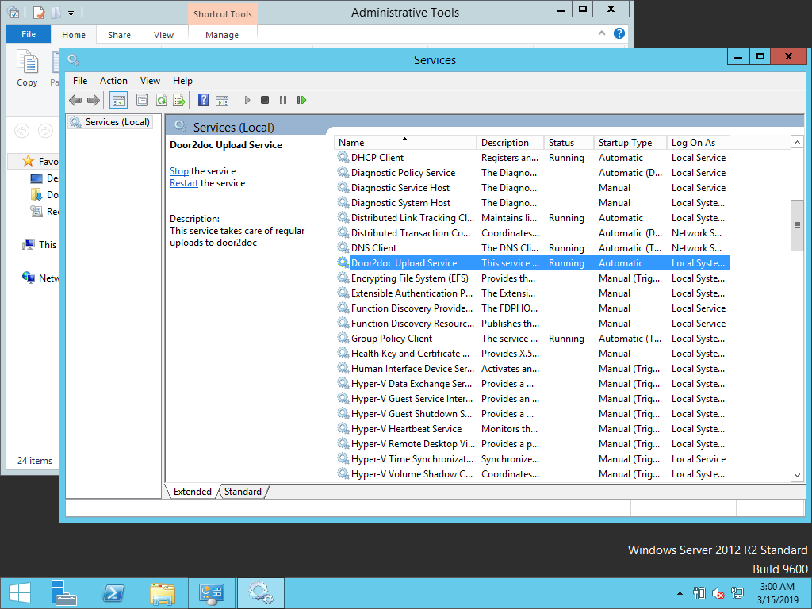
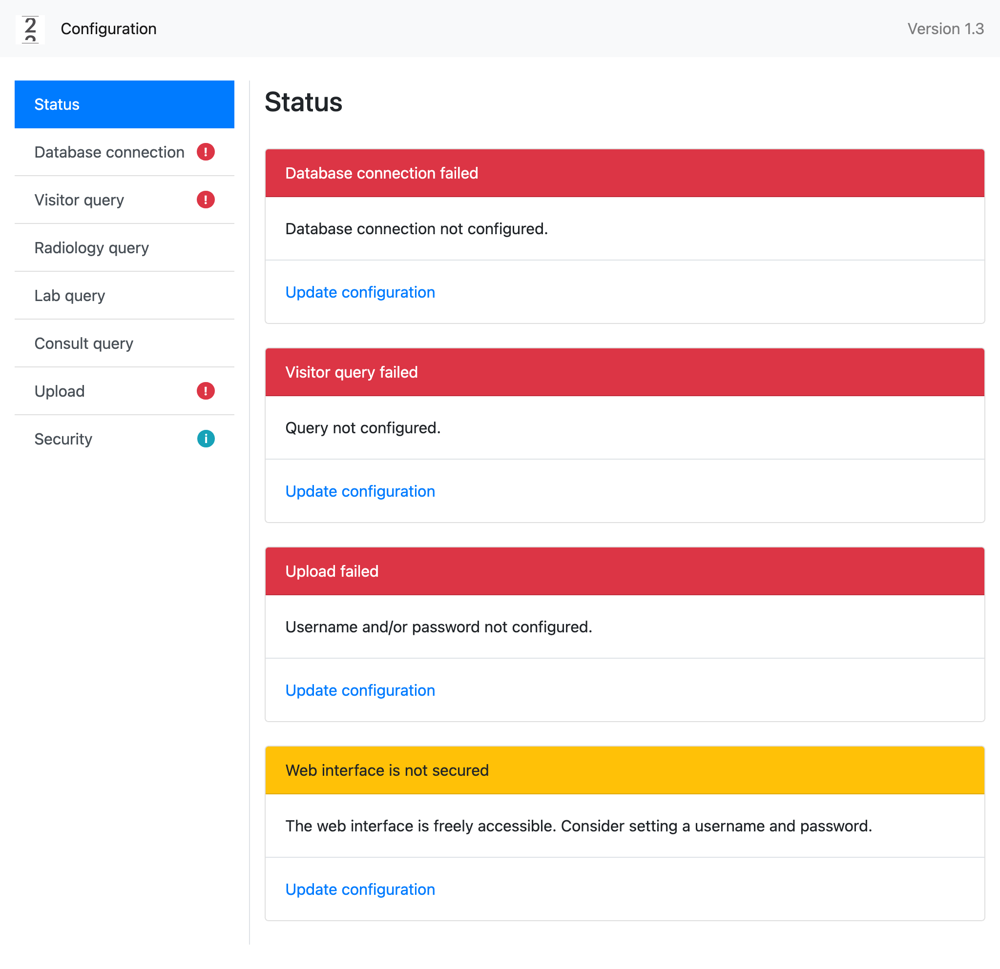
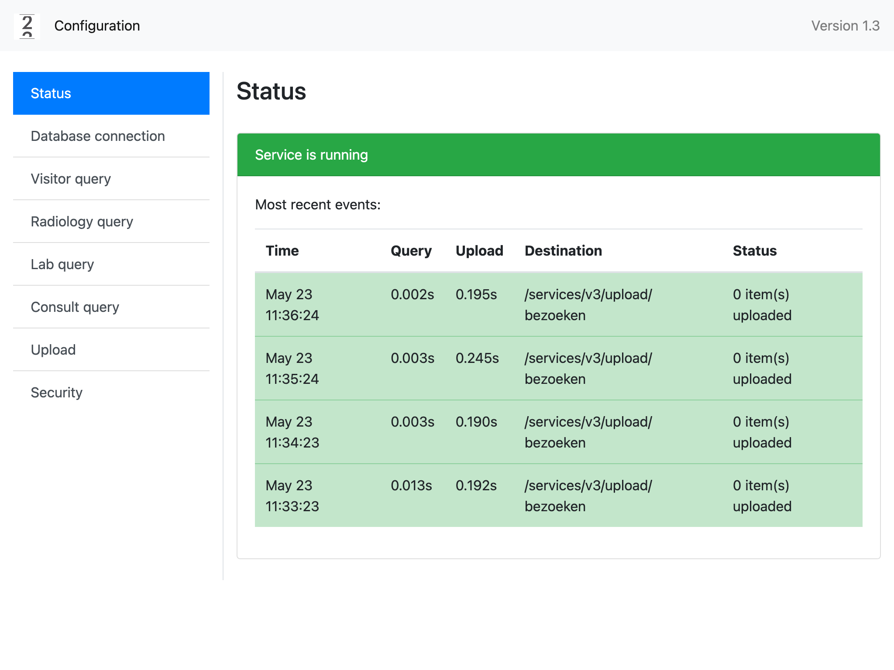
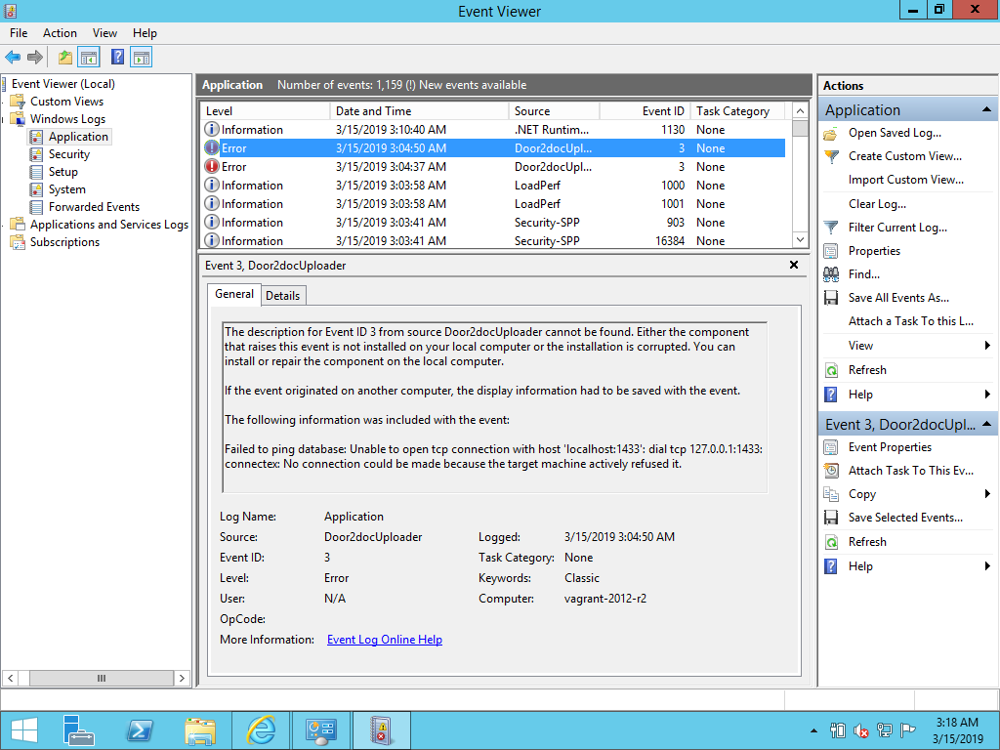

# Overzicht

Dit document beschrijft de installatie van de door2doc Upload Service -- een Windows service die op regelmatige basis 
data uitleest uit het ZIS en deze doorzet naar de door2doc Cloud omgeving.  

# Voorbereidingen

Voordat u aan de installatie kunt beginnen, dient over het volgende te beschikken:

## Server 
Een server waarop de Upload Service geïnstalleerd kan worden. Dit hoeft geen dedicated server te zijn. Deze server
moet connectie kunnen maken met de ZIS database, en moet connectie kunnen maken met `https://integration.door2doc.net`.

## Database gegevens
Om verbinding te maken met de database is er een connectie string nodig. De Upload Service ondersteunt zowel ADO als ODBC 
strings. 

Voorbeeld van een ADO string: 

`Server=myServerAddress;Database=myDataBase;User Id=myUsername; Password=myPassword;`

Voorbeeld van een ODBC string: 

`odbc:server=localhost;user id=sa;database=master;app name=MyAppName`

## Door2doc Credentials
Voor de upload naar door2doc heeft de service een door2doc gebruikersnaam en wachtwoord nodig. Deze krijgt u door ons geleverd. 

## Queries
De Upload Service voert op regelmatige basis queries uit om de data uit uw database te halen. Deze queries worden door
door2doc en uw dienst informatievoorziening opgesteld en aangeleverd. 

## Software
U kunt de laatste versie van deze software downloaden van 

`https://github.com/Door2doc/d2d-uploader/releases`. 

De software wordt geleverd als `.msi` bestand.  

# Installatie

## De-installatie 

Als u een oudere versie van de door2doc Upload Service hebt draaien, dient u deze eerst te de-installeren. Dit gaat
op de gebruikelijke manier: via het Start Menu kiest u Control Panel > Programs > Uninstall a program.

{height=50%}\ 

Selecteer de "Door2doc Upload Service" en klik op Uninstall.

{height=50%}\  

## Installatie 

Installatie vindt plaats door een dubbelklik op het `.msi` bestand:

{height=50%}\   

Dit moet in enkele seconden afgerond zijn. U kunt de installatie verifiëren via Administrative Tools > Services. 
Hier is nu de service Door2doc Upload Service te zien in de status Running. 

{height=50%}\ 

# Configuratie

De service dient nu geconfigureerd te worden. Dit gebeurt via een web interface op `http://localhost:17226`.

{height=50%}\ 

Vul hier de gegevens in die u aan het begin verzameld hebt. Wanneer alle gegevens correct zijn ingevoerd, zal 
de service de volgende status geven. 

{height=50%}\ 

# Beheer

De service kan gepauzeerd worden via Administrative Tools > Services. 

Foutmeldingen worden naar de Windows event log gestuurd, en kunnen worden gemonitord via de Windows Event Viewer:

{height=50%}\
